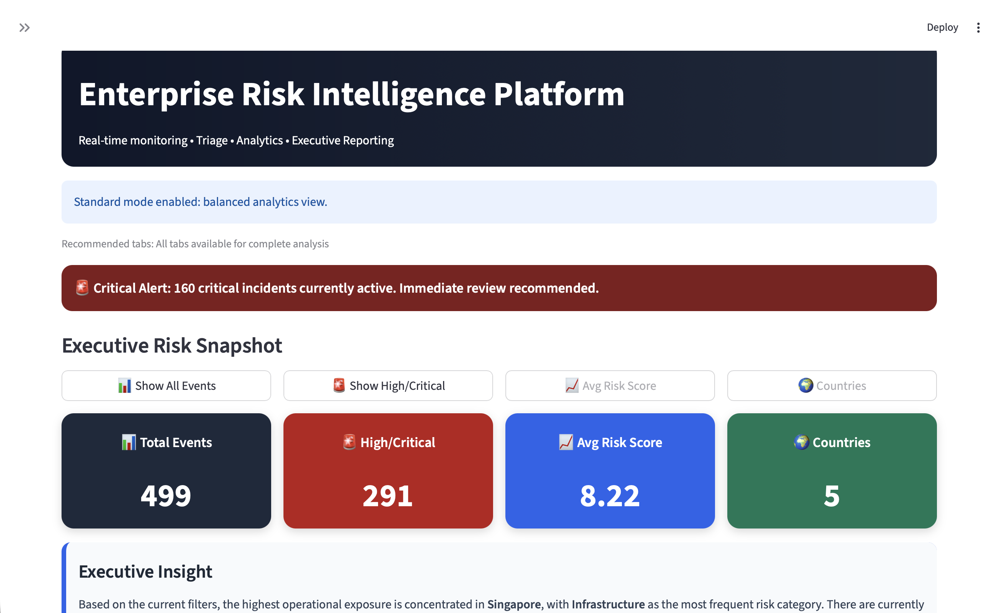
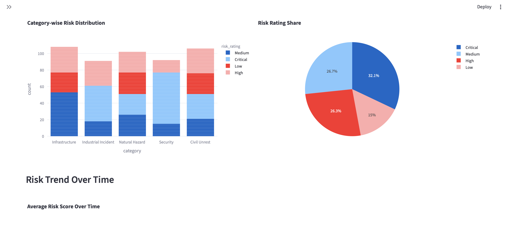
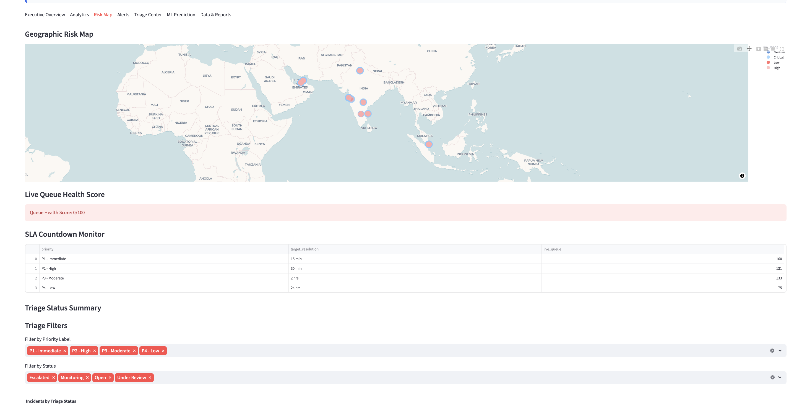
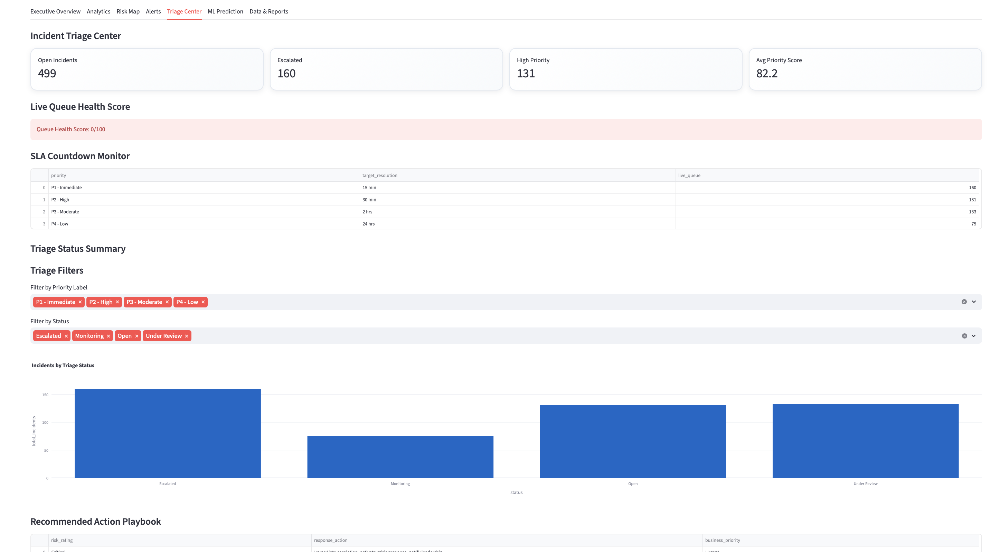
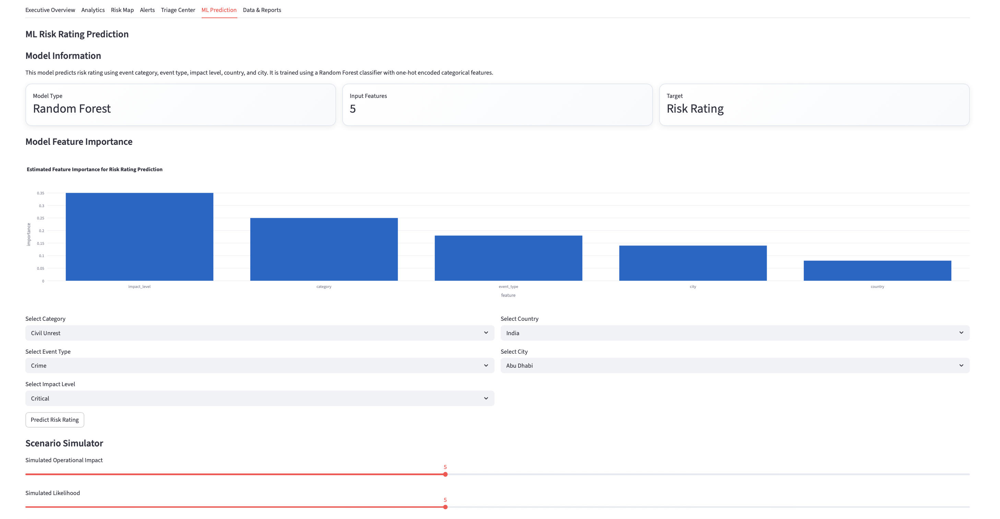

# Enterprise Risk Intelligence Platform

AI-driven operational risk analytics and decision intelligence dashboard for enterprise monitoring, triage, and executive reporting.

---

## Features

- Real-time Risk Monitoring
- Executive Analytics Dashboard
- ML-Based Risk Scoring
- Risk Heatmap & Geospatial Mapping
- Triage Center
- Incident Classification
- Predictive Risk Intelligence
- Interactive Filtering & Search
- CSV Upload Support
- Executive Reporting

---

## Technology Stack

- Python
- Streamlit
- Plotly
- Pandas
- SQLAlchemy
- SQLite
- Machine Learning

---

## Dashboard Preview

### Executive Dashboard



---

### Analytics View



---

### Risk Map



---

### Triage Center



---

### ML Prediction



---

## Project Structure

```bash
app/
data/
database/
models/
reports/
src/
README.md
requirements.txt